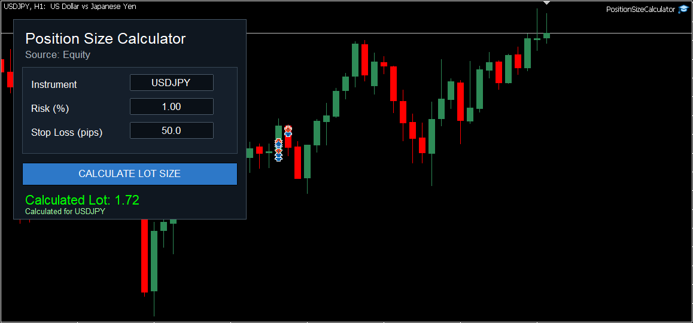
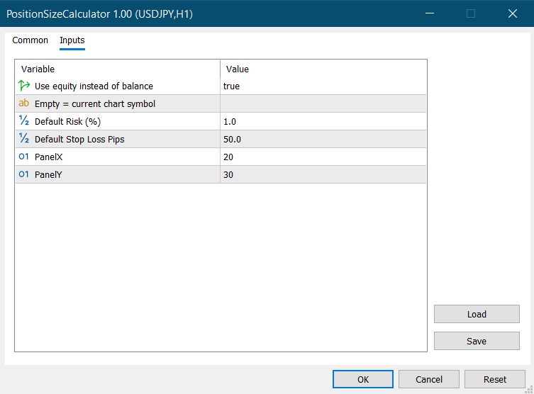

# MQL5 Position Size Calculator

A MetaTrader 5 dashboard EA for calculating lot size based on instrument name, risk percentage, and stop loss in pips.

This tool is designed for traders who want to quickly calculate position size before placing a trade. The user can enter the trading instrument, risk percentage, and stop loss distance directly from the chart panel.

> ⚠️ This project is for educational and portfolio demonstration purposes only. Trading involves risk. It is not financial advice and does not guarantee profitable results.

---

## Overview

MQL5 Position Size Calculator is a chart-based utility EA for MetaTrader 5.

It does not open trades.
It only calculates the suggested lot size based on the user’s risk settings.

The dashboard allows users to enter:

* Instrument / symbol name
* Risk percentage
* Stop loss in pips

After clicking the calculate button, the EA displays the calculated lot size directly on the chart.

---

## Key Features

* Chart-based calculator dashboard
* Editable instrument/symbol input
* Editable risk percentage input
* Editable stop loss pips input
* One-click lot size calculation
* Supports current chart symbol by default
* Uses balance/equity-based risk calculation
* Calculates based on broker symbol settings
* Simple and clean MQL5 chart UI
* Does not open or close trades

---

## How It Works

The EA calculates lot size using:

* account balance or equity
* selected risk percentage
* stop loss distance in pips
* symbol tick value
* symbol lot step

The formula is based on risk amount divided by estimated loss per lot for the selected stop loss distance.

Example:

```text
Account Balance: 10,000
Risk: 1%
Stop Loss: 50 pips
Risk Amount: 100
Calculated Lot: based on symbol tick value and broker lot step
```

---

## Input Parameters

| Input                     | Description                                                             |
| ------------------------- | ----------------------------------------------------------------------- |
| `UseEquityForCalculation` | If true, the EA uses account equity instead of balance                  |
| `DefaultSymbol`           | Default symbol shown in the dashboard. Empty means current chart symbol |
| `DefaultRiskPercent`      | Default risk percentage                                                 |
| `DefaultStopLossPips`     | Default stop loss distance in pips                                      |
| `PanelX`                  | Dashboard horizontal position                                           |
| `PanelY`                  | Dashboard vertical position                                             |

---

## Dashboard Controls

| Control              | Description                                 |
| -------------------- | ------------------------------------------- |
| `Instrument`         | Symbol/instrument name used for calculation |
| `Risk (%)`           | Risk percentage per trade                   |
| `Stop Loss (pips)`   | Stop loss distance in pips                  |
| `Calculate Lot Size` | Calculates and displays the lot size        |

---

## Best Use Case

This tool is useful for:

* Manual traders
* Scalpers
* Risk-based trading
* Forex and CFD lot calculation
* Quick pre-trade position sizing
* MQL5 dashboard UI demonstration

---

## Screenshot

### Position Size Calculator Dashboard



### Position Size Calculator Inputs




---

## Installation

1. Download `PositionSizeCalculator.mq5`.
2. Open MetaTrader 5.
3. Go to:

```text
File > Open Data Folder > MQL5 > Experts
```

4. Copy `PositionSizeCalculator.mq5` into the `Experts` folder.
5. Restart MetaTrader 5 or refresh the Navigator panel.
6. Attach the EA to a chart.
7. Enter instrument, risk percentage, and stop loss pips.
8. Click `Calculate Lot Size`.

---

## Important Notes

* This EA does not place trades.
* The instrument name must match the exact broker symbol.
* If your broker uses suffixes like `EURUSDm`, `XAUUSD.a`, or `US30.cash`, enter the exact symbol name.
* Always verify the calculated lot size before trading.
* Test on a demo account first.

---

## Risk Warning

Position size calculators can help with risk planning, but they cannot remove trading risk.

Broker conditions, tick value, contract size, spread, slippage, and symbol settings may affect calculation accuracy.

The developer is not responsible for any trading losses.

---

## Project Structure

```text
mql5-position-size-calculator/
│
├── PositionSizeCalculator.mq5
├── README.md
└── screenshots/
    └── dashboard.png
```

---

## Developer

**MubinCodes**
Software Developer specializing in MQL4/MQL5 trading bots, custom indicators, Python automation, and financial software.

GitHub: https://github.com/MubinCodes
Fiverr: https://www.fiverr.com/mubinbhaiya?public_mode=true
